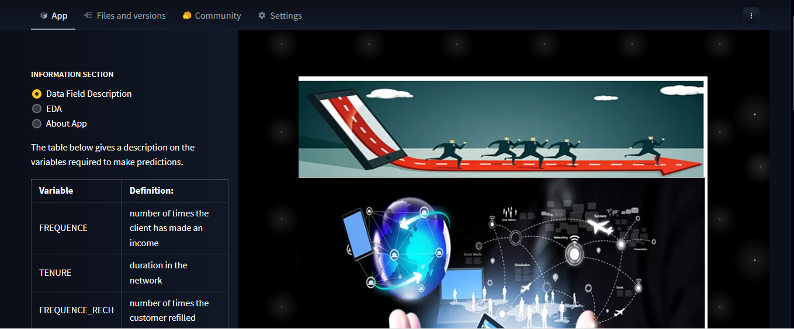
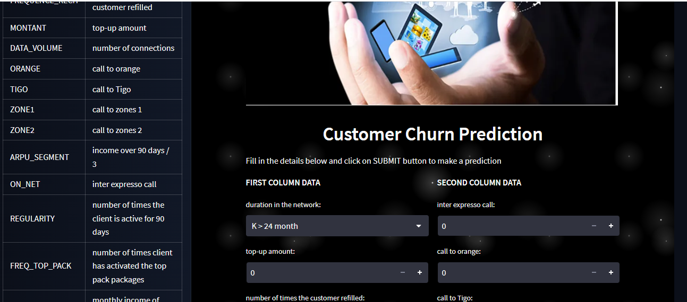
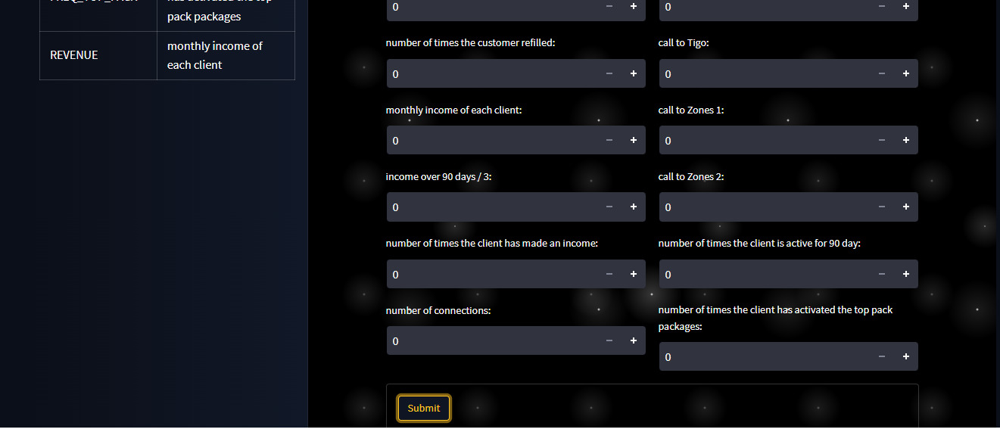
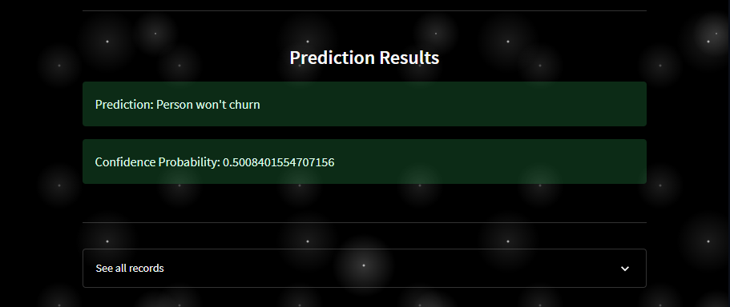

# Web_App_for-Expresso_Customer_Churn

This projet is based on a Zindi challenge for an African telecommunications company(Expresso) that provides customers with airtime and mobile data bundles. The objective of this challenge is to develop a machine learning model to predict the likelihood of each customer “churning,” i.e. becoming inactive and not making any transactions for 90 days.

This repository contains a web App with a user-friendly interface, which I have embed my ML model from Expresso Customer Churn Prediction Project. This solution will help this telecom company to better serve their customers by understanding which customers are at risk of leaving.

### Manual Setup

For manual installation, you need to have [`Python3`](https://www.python.org/) on your system. Then you can clone this repo and being at the repo's `root :: friendly_web_interface_for_ML_models> ...`  follow the steps below:

- Windows:
        
        python -m venv venv; venv\Scripts\activate; python -m pip install -q --upgrade pip; python -m pip install -qr requirements.txt  

- Linux & MacOs:
        
        python3 -m venv venv; source venv/bin/activate; python -m pip install -q --upgrade pip; python -m pip install -qr requirements.txt  

    **NB:** For MacOs users, please install `Xcode` if you have an issue.

- Run the demo apps (being at the repository root):

        streamlit run churn_app.py

- You can access the hosted app on Huggingface spaces at the link below :
        
    [click here](https://huggingface.co/spaces/Gyimah3/Expresso_Customer_Churn_app)
    
    
- You can access the hosted app on streamlit cloud at the link below :
        
    [click here](https://)https://gyimah3-web-app-for-expresso-customer-churn-churn-app-t8mqve.streamlit.app/)
    
    
 ## Screenshots

<table>
    <tr>
        <th>Interface and sidebar</th>
        <th>Input Interface and SideBar</th>
        <th>Input Interface and Bar</th>
        <th>After Prediction</th>
    </tr>
    <tr>
        <td></td>
        <td></td>
        <td></td>
        <td></td>
    </tr>
</table>

    
  ## Author:
[Gyimah Gideon](https://www.linkedin.com/in/gideon-gyimah-08268b243/)  

   
